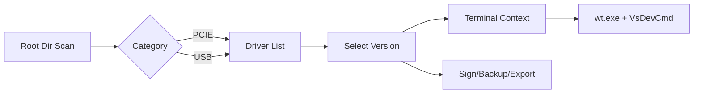

# 🚢 Driver Deck
> Industrial-grade Windows Driver management and build orchestration.

[](https://github.com/iantsaitw/Utility/releases)
[](./scripts/build.bat)
[](https://github.com/rdbende/Sun-Valley-ttk)

**Driver Deck** is a high-performance GUI utility engineered for kernel developers. It centralizes project scanning, environment setup, and signing into a single, cohesive workflow.

---

## 📸 Visual Showcase
*(Manual Action: Place UI screenshots in `./docs/` and link them here)*

---

## ✨ Key Capabilities

### 🖥️ Immersive Terminal (Win32 Embedded)
- **Zero Latency**: Real-time native shell performance.
- **Color Support**: Powered by `wt.exe` for full ANSI rendering.
- **Focus Guard**: Proprietary Win32 focus recovery via global click listener.

### 🏗️ Build & Environment
- **Project Intelligence**: Auto-scans and categorizes PCIE/USB driver trees.
- **One-Click Signing**: Seamless integration with `signtool.exe` and PFX management.
- **Smart Suffix**: Auto-updating timestamps while preserving manual notes.

---

## 🚀 Quick Start

### 📦 For Users (Portable EXE)
1. Download `DriverDeck.exe` from [Latest Releases](https://github.com/iantsaitw/Utility/releases).
2. **Run as Administrator** (Required for terminal and driver access).

### ⌨️ For Developers (Source)
```powershell
# Clone and install
pip install sv-ttk

# Launch
python main.py
```

---

## 🛠️ System Workflow


---

## 📂 Project Architecture

```text
Driver Deck/
├── scripts/             # Automation hub (build.bat, release.bat)
├── dist/                # Production binaries (DriverDeck.exe)
├── release/             # Local versioned archives (Git ignored)
├── main.py              # Application entry and window orchestration
├── terminal_widget.py   # Low-level Win32 window embedding & focus logic
├── project_tab.py       # Driver lifecycle logic and UI tab management
├── config.py            # Dynamic settings and versioning (VERSION sync)
├── driver_utils.py      # Win32 versioning and SignTool helpers
├── ui_factory.py        # Modular Win11-themed widget factory
├── VERSION              # Single source of truth for versioning
└── icon.ico             # High-DPI application branding
```

---

## ⚙️ Configuration Reference (`settings.json`)

| Key | Description | Default |
| :--- | :--- | :--- |
| `root_dir` | The base path where your driver projects are located. | `E:\Project` |
| `theme_mode` | Application appearance: `Dark` or `Light`. | `Dark` |
| `symbol_filter` | Startup filter state: `All`, `Symbol`, or `No Symbol`. | `All` |
| `pfx_path` | Path to your digital certificate for signing. | `""` |
| `font_family` | Global UI font face. | `Segoe UI` |

---

## 🔍 Troubleshooting

| Issue | Solution |
| :--- | :--- |
| **Terminal is blank** | Ensure you run the application as **Administrator**. |
| **Focus Lock** | Click anywhere on the non-terminal UI to regain keyboard control. |
| **Missing VS** | Visual Studio 2022 Professional/Community must be in default paths. |

---
*Status: Production Ready | v1.2.1*