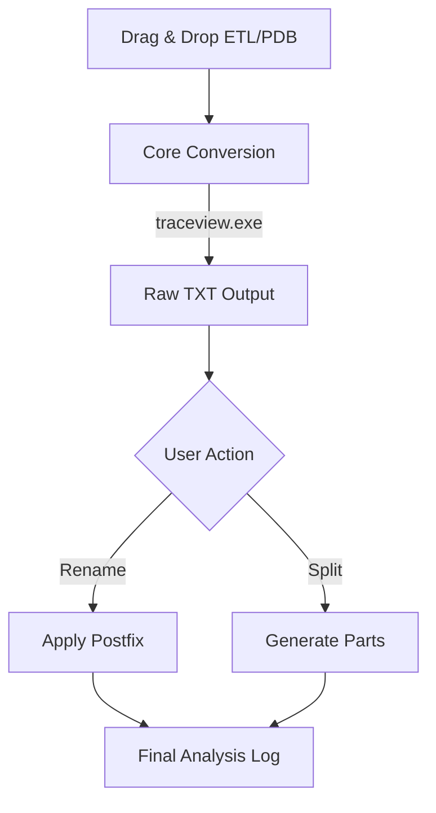

# 🧶 ETL Weaver
> High-precision diagnostic engine for Windows Event Trace Log analysis.

---

## 📸 Screenshots
*(Manual Action: Showcase the conversion feedback and the side-by-side settings panel)*

---

## 🛠️ System Workflow

---

## 💎 Features

### 🛡️ Legacy Stability, Modern Power
- **Reliable Core**: Bundles Microsoft `traceview.exe` to ensure zero data loss.
- **High Priority**: Executes conversion with elevated process priority for speed.
- **Postfix Engine**: Integrated renaming logic for better log organization.

### 🎨 Design & Experience
- **Dynamic Theming**: Windows 11 Dark/Light mode support.
- **Side-by-Side UI**: Optimized layout for simultaneous renaming and splitting.

---

## ⚙️ Configuration Reference (`settings.json`)

| Key | Description | Default |
| :--- | :--- | :--- |
| `theme` | UI color scheme: `dark` or `light`. | `dark` |
| `pdb_path` | Default folder to search for symbol files. | `C:\` |
| `ui_font_size` | Size of labels and button text. | `10` |
| `log_font_size` | Size of the text in the execution log window. | `10` |

---

## 🔍 Troubleshooting

| Issue | Solution |
| :--- | :--- |
| **Empty Listbox** | Click the **Scan** button next to Search Path to load symbols. |
| **Rename Failed** | Ensure the TXT file is not open in another text editor. |
| **Import Error** | Run `scripts/build.bat` to ensure all config constants are bundled. |

---
*Status: Production Ready | v1.1.0*