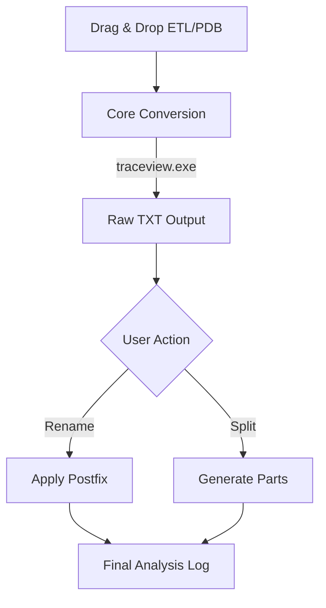

# 🧶 ETL Weaver
> High-precision diagnostic engine for Windows Event Trace Log analysis.

[](https://github.com/iantsaitw/Utility/releases)
[](./trace_tools/)
[](./CHANGELOG.md)

**ETL Weaver** is a high-speed diagnostic utility designed to transform raw ETL traces into structured analysis. It focuses on data integrity, bypassing common truncation bugs found in modern tools.

---

## 📸 Visual Showcase
*(Manual Action: Showcase the conversion feedback and the side-by-side settings panel)*

---

## 💎 Features

### 🛡️ Legacy Stability, Modern Power
- **Reliable Core**: Bundles Microsoft `traceview.exe` to ensure zero data loss.
- **Drag & Drop**: Native integration for ETL, PDB, and TXT files.
- **High Priority**: Executes conversion with elevated process priority for speed.

### 📝 Smart TXT Management
- **Postfix Engine**: Add custom suffixes to outputs automatically.
- **Instant Rename**: Apply postfix renaming to existing logs with one click.
- **Precision Splitting**: Split massive TXT files into manageable chunks.

---

## 🚀 Quick Start

### 📦 For Users (Portable EXE)
1. Download `ETLWeaver.exe` from [Latest Releases](https://github.com/iantsaitw/Utility/releases).
2. Load your **ETL** and corresponding **PDB** files via drag & drop.
3. Click **Convert** to generate analyzed output.

---

## 🛠️ System Workflow


---

## 📂 Project Architecture

```text
ETL Weaver/
├── scripts/             # Automation hub (build.bat, release.bat)
├── trace_tools/         # Bundled verified MS trace binaries (TraceView, TraceFmt)
├── dist/                # Production binaries (ETLWeaver.exe)
├── release/             # Local versioned archives (Git ignored)
├── main.py              # Application entry point
├── ui_main_window.py    # Win11 Fluent UI and logic orchestration
├── core_logic.py        # Conversion, Splitting, and Renaming algorithms
├── config.py            # App settings and dynamic VERSION handling
├── utils.py             # Path helpers and data formatting
├── VERSION              # Version source of truth
└── icon.ico             # Application branding
```

---

## ⚙️ Configuration Reference (`settings.json`)

| Key | Description | Default |
| :--- | :--- | :--- |
| `theme` | UI color scheme: `dark` or `light`. | `dark` |
| `pdb_path` | Default folder to search for symbol files. | `C:\` |
| `ui_font_size` | Size of labels and button text. | `10` |
| `log_font_size` | Size of the text in the execution log window. | `10` |

---

## 🔍 Troubleshooting

| Issue | Solution |
| :--- | :--- |
| **Empty Listbox** | Click the **Scan** button next to Search Path to load symbols. |
| **Rename Failed** | Ensure the TXT file is not open in another text editor. |
| **Import Error** | Run `scripts/build.bat` to ensure all config constants are bundled. |

---
*Status: Production Ready | v1.1.0*