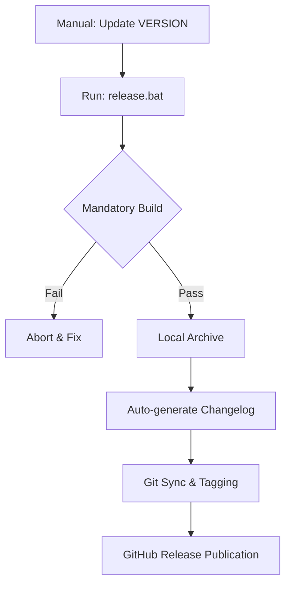

# 🛠️ Windows Utility Suite
> **Efficiency through Automation.** A premium collection of high-performance internal tools engineered for Windows Driver development, system debugging, and ETL log analysis.

[](https://github.com/iantsaitw/Utility)
[](https://github.com/iantsaitw/Utility/commits/master)
[](./GEMINI.md)

---

## 🎯 Which tool do I need?

| If you want to... | Use this Tool | Key Feature |
| :--- | :--- | :--- |
| Manage Driver Lifecycle | [**🚢 Driver Deck**](./Driver%20Deck) | Win32 Embedded Terminal & One-click Signing |
| Analyze Trace Logs | [**🧶 ETL Weaver**](./ETL%20Weaver) | Stable `traceview` Engine & TXT Splitting |
| Build Multi-project | [**Standardized Scripts**](./GEMINI.md) | Unified `release.bat` & `build.bat` workflow |

---

## 🚀 Project Matrix

| Tool | Version | Direct Download | History |
| :--- | :--- | :--- | :--- |
| **Driver Deck** | [](https://github.com/iantsaitw/Utility/releases) | [📦 Download EXE](https://github.com/iantsaitw/Utility/releases) | [📜 Changelog](./Driver%20Deck/CHANGELOG.md) |
| **ETL Weaver** | [](https://github.com/iantsaitw/Utility/releases) | [📦 Download EXE](https://github.com/iantsaitw/Utility/releases) | [📜 Changelog](./ETL%20Weaver/CHANGELOG.md) |

---

## 🏗️ Automation Architecture
Every project in this suite adheres to a unified CI/CD-inspired local release pipeline:



---

## 💎 Design Philosophy
- **Zero-Installation**: Standalone, portable executables.
- **Fluent Experience**: Unified Win11 Dark/Light mode via `sv-ttk`.
- **High Performance**: Native Win32 API integration.
- **DPI Aware**: Optimized for modern high-resolution displays.

---

## 📂 Repository Anatomy
```text
Utility/
├── 🚢 Driver Deck/      # Flagship Driver management and build system
├── 🧶 ETL Weaver/       # High-speed diagnostic trace analysis engine
├── GEMINI.md            # Master status record and global release workflow
├── README.md            # Suite entrance and project matrix (this file)
└── .gitignore           # Global exclude rules
```

---

## 👨‍💻 Release Workflow
To deploy a new version:
1. **Commit** functional changes.
2. **Bump** version in `VERSION` file.
3. **Run** `scripts/release.bat`.

---
*Internal Engineering Toolset - Realtek Semiconductor Corp.*